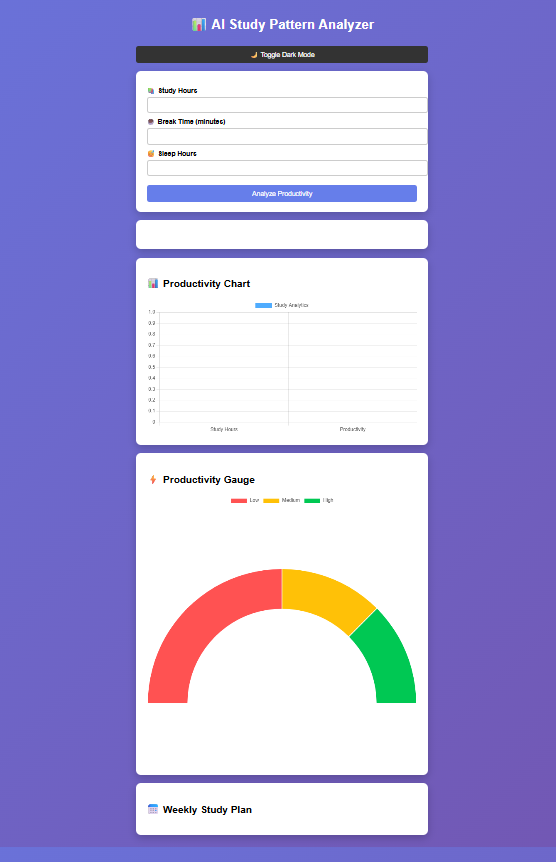
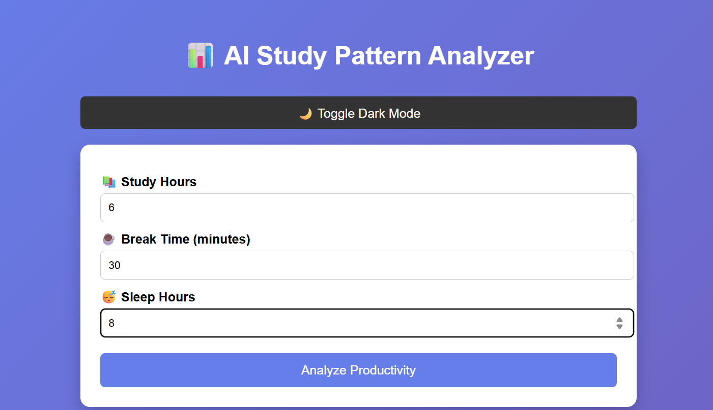
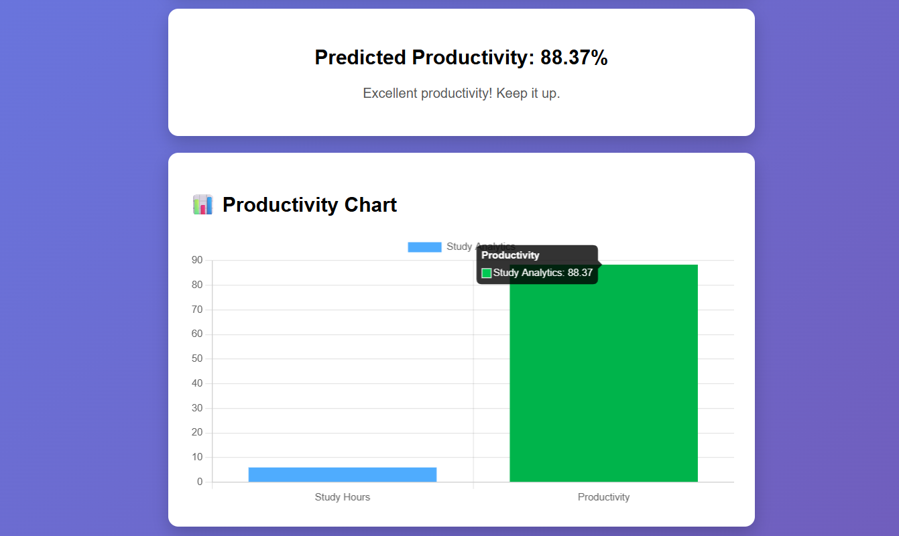
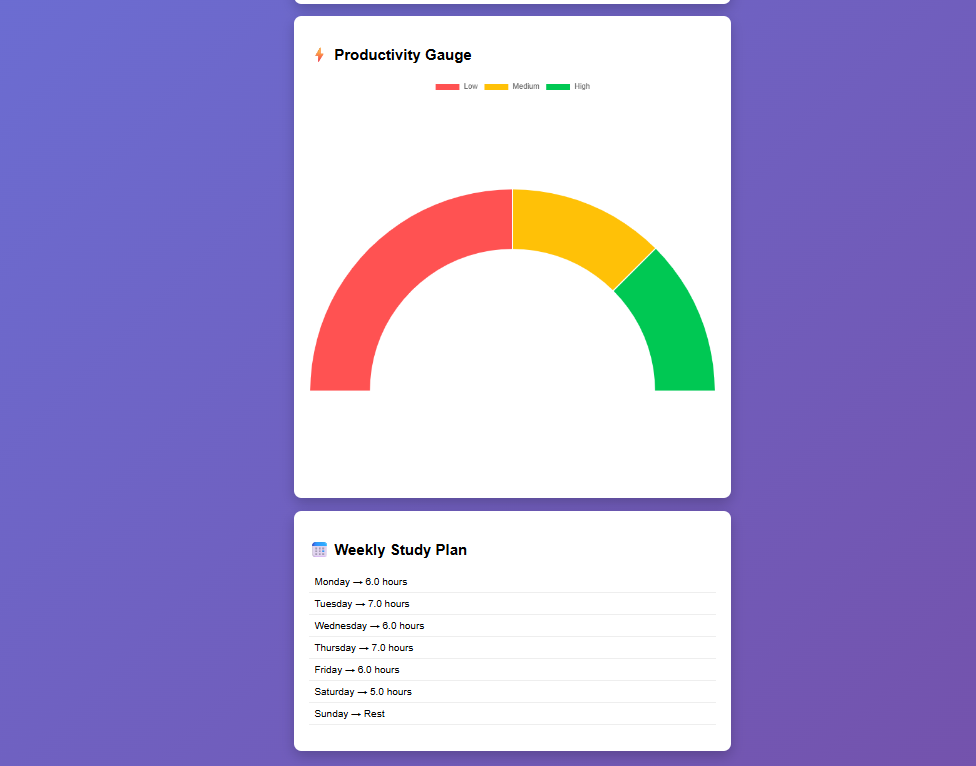

# 📊 AI Study Pattern Analyzer

AI-powered web application that analyzes student study patterns, predicts performance, and provides personalized insights using Machine Learning and Flask.

---

## 🚀 Features
- 📊 Study pattern analysis  
- 🤖 ML-based predictions  
- 📈 Performance insights  
- 🎯 Smart recommendations  
- 🌐 Interactive web interface  

---

## 🛠 Tech Stack
- Frontend: HTML, CSS, JavaScript  
- Backend: Flask (Python)  
- Machine Learning: Scikit-learn  
- Data Processing: Pandas, NumPy  

---

## 🧠 How It Works

1. User inputs study-related data  
2. Data is processed using Pandas  
3. Pre-trained ML model analyzes patterns  
4. Predictions are generated  
5. Results displayed via Flask web app  

---

## 📷 Preview
## 📷 Preview

### 🏠 Home Page




### 📊 Result Page





---

## ⭐ Key Highlights
- End-to-end ML project  
- Integrated ML model with Flask  
- Real-world use case  
- Clean UI design  

---

## ⚙️ Run Locally

```bash
git clone https://github.com/Nairayadav/AI-Study-Pattern-Analyzer.git
cd AI-Study-Pattern-Analyzer
pip install -r requirements.txt
python app.py

[def]: image.png